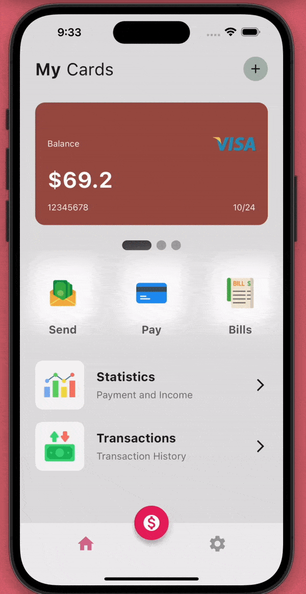

Quantitative Finance Application

still not done yet guys lol 
I also changed up the interface prototype drastically from my previous milestone for easier usage.
Previous prototype: https://github.com/jojo142/QuantPortfolio

## Preview

A powerful yet user-friendly quantitative finance application designed to provide you with comprehensive market insights and advanced portfolio management tools. Whether you're an experienced trader or just starting out, Tradesense.io offers the tools and data you need to make informed investment decisions. 

# Features:
- Personal Wallet: Send and Recieve money
- Real-Time Market Data: Stay up-to-date with real-time market data, enabling you to monitor price movements, trends, and news across a wide range of financial instruments.
- Portfolio Management: Effortlessly manage your investment portfolio. Track your assets, monitor performance, and make adjustments as needed, all within the app.
- Investment Analysis: Dive deep into investment opportunities using advanced analytical tools. Evaluate potential risks and rewards, helping you make well-informed decisions.
- Trading Insights: Benefit from comprehensive market insights and analysis. Make use of data-driven research to enhance your trading strategies.
- User-Friendly Interface: Tradesense.io boasts an intuitive and easy-to-navigate interface, ensuring that both beginners and experienced traders can effectively harness its capabilities.

